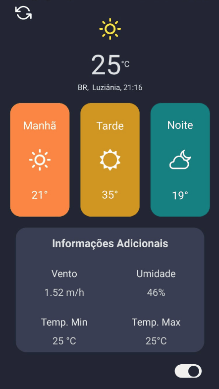

<h1 align="center">
  <p>Project Shopping lists 🍎</p>
</h1>

<h1 align="center" >
  

 
</h1>

## 🧾 About

App Criado para poder verificar o tempo!

## 🔧 Tools

- [openweathermap](https://openweathermap.org/)
- [React Native](https://reactnative.dev)

## 👨‍💻 How to Setup

```bash
  # Clone the project
  $ git clone https://github.com/Agotsilv/weatherapp
```
```bash
  # Enter directory
  $ cd weatherapp
```

```bash
  # Install the dependencies, if you use npm
  $ npm install
```
<p align="center">or</p>

```bash
  # Install the dependencies, if you use yarn
  $ yarn
```

## 👨🏽‍🦲 &nbsp;Social Links

<p align="left" style="background:yellow">
<a href="https://www.linkedin.com/in/agotsilva/" target="_blank">
  
</a>
<a href="https://instagram.com/ago.tsilv" target="_blank">
 
</a>
</p>
<p align="center">By Tiago Oliveira</p>
